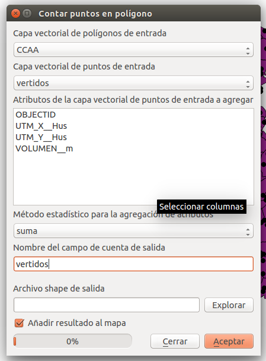
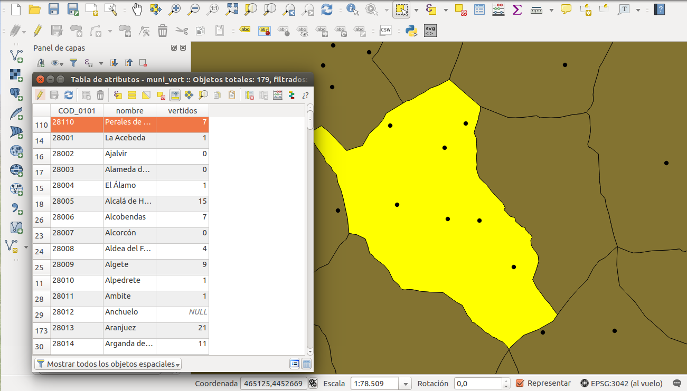
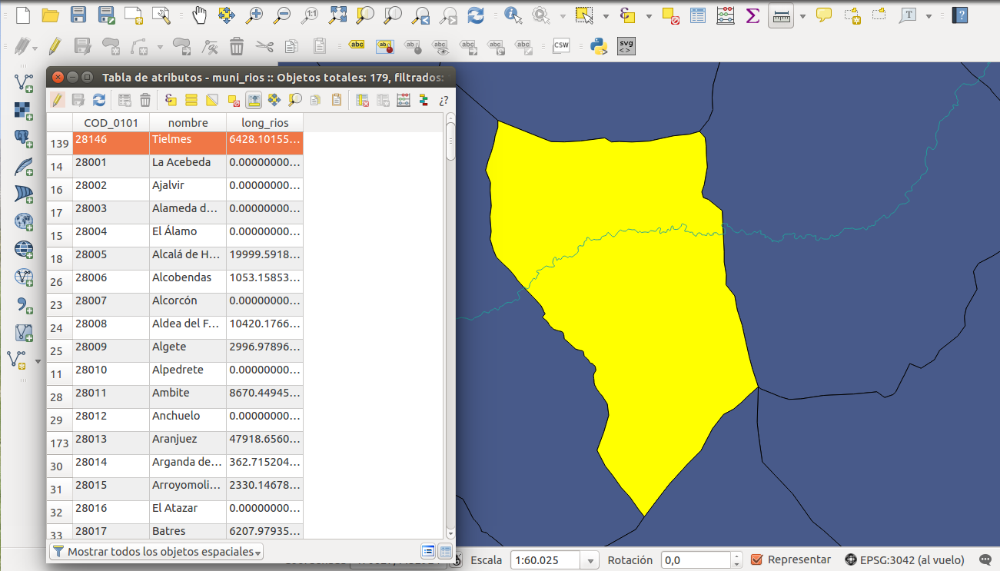
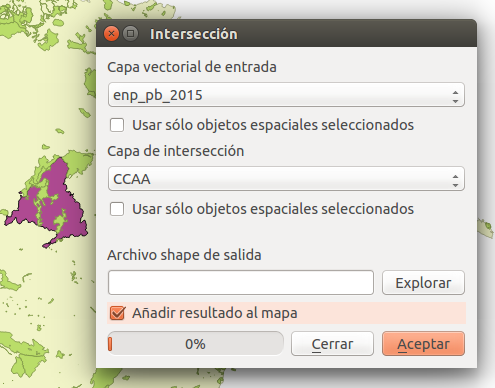
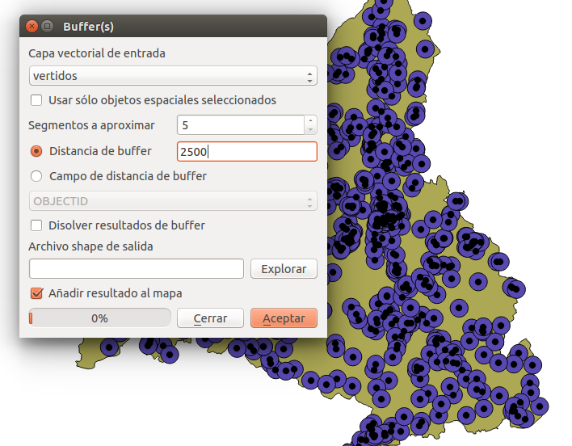
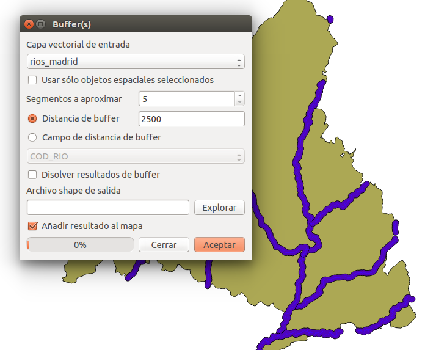
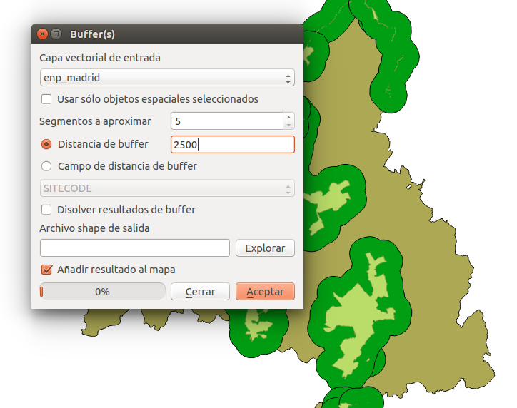
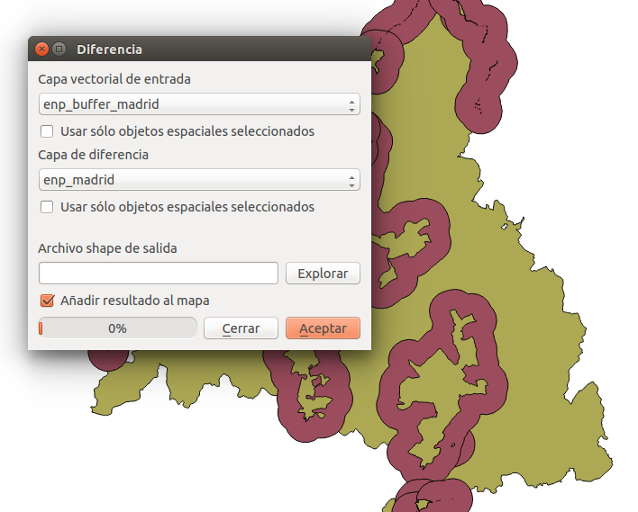
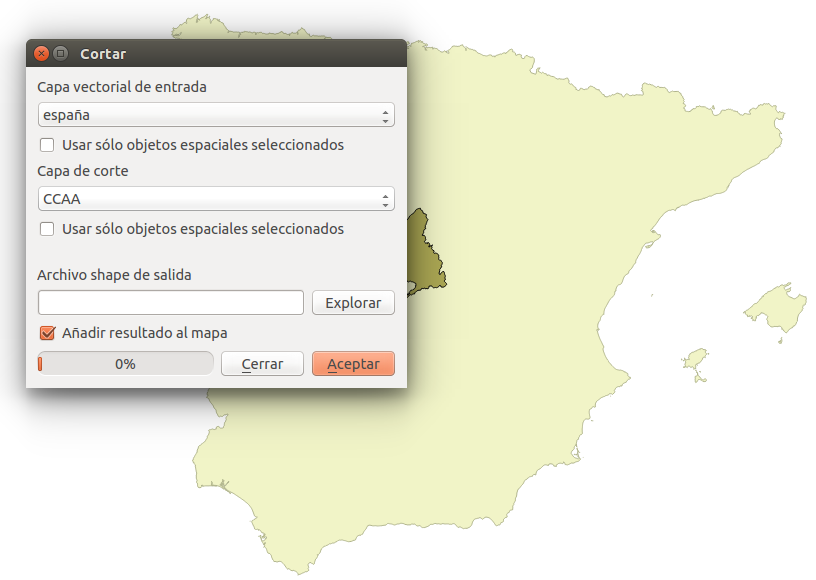

# Análisis Vectorial I

En este curso de *Introducción a QGIS* únicamente se explicará las herramientas de análisis
de uno de los tipos de datos geoespaciales: **los archivos o datos vectoriales**. QGIS tiene en 
su barra de herramientas una pestaña dedicada a este grupo de procedimientos: "Vectorial". Dentro 
de ella encontraremos las siguientes opciones:

* OpenStreetMap
* Herramientas de Análisis
* Herramientas de Investigación
* Herramientas de Geoproceso
* Herramientas de Geometría
* Herramientas de Gestión de Datos

Debido al enfoque introductorio de este curso, de estas seis aplicaciones solo se tratarán 
cuatro de ellas: `análisis`, `investigación`, `geoproceso` y `geometría`. Estos mecanismos permiten al usuario interactuar con una o dos capas vectoriales, pero **siempre que estén en la misma proyección**.

## Herramientas de Análisis

Esta caja de herramientas nos permite realizar operaciones básicas de análisis como 
contar puntos o calcular la longitud de líneas en una capa base de polígonos.

### Puntos en Polígonos

Esta opción nos permite calcular la suma (u otra operación aritmética) de puntos que
se encuentran sobre una capa poligonal. Esta operación se puede realizar sobre la totalidad
de la superficie de la capa o de manera segmentada. Es decir, calcular el subconjunto de
puntos que existen sobre cada uno de los *features* o partes que componen la capa poligonal.
Una vez en la ventana debemos seleccionar la capa poligonal, la capa de puntos, los campos
de esta última a añadir (opcional), la operación (en nuestro caso *suma*) y el nombre del
nuevo campo donde aparecerá el resultado. Por último nombraremos el archivo de salida.

Es recomendable comprobar que la operación se ha realizado correctamente. Si las dos capas
no compartían la misma proyección no obtendremos resultado alguno (QGIS nos avisa con antelación).

### Sumar Longitud de Líneas

Esta herramienta nos permite calcular la longitud de una capa de líneas que se encuentran sobre una capa poligonal. Muy similar a la opción anterior, esta operación se puede realizar sobre la totalidad de la superficie de la capa o de manera segmentada. Una vez en la ventana debemos seleccionar la capa poligonal, la capa de líneas y el nombre del nuevo campo donde aparecerá el resultado. Por último nombraremos el archivo de salida.

Una vez más es recomendable comprobar que el proceso ha corrido como es debido. Por ejemplo, se 
puede verificar que en los polígonos donde no pasa línea alguna, el campo es 0. Por otro lado, en
las *features* donde si que pase una línea podemos utilizar la herramienta `Medir Línea` para
medir aproximadamente el tramo.

## Herramientas de Geoproceso

El geoprocesamiento es una de las operaciones más útiles que presenta un software GIS. QGIS 
presenta una selección de las más potentes, además otras tantas pueden ser añadidas a través
de *plugins*. Entre ellas hemos destacado las operaciones de `intersección`, `buffer`, `diferencia`
y `corte`.

### Intersección

A partir del mecanismo de intersección, el usuario puede cruzar dos capas y obtener una nueva con la combinación deseada de *atributos* y configuración espacial. En nuestro caso queremos obtener de la capa de espacios protegidos (`capa de entrada`) únicamente aquellos que interseccionen con la capa de la Comunidad de Madrid (`capa de intersección`).

De igual manera sucede en el caso de los ríos.

Como resultado obtendremos dos capas nuevas, una de espacios protegidos y otra de ríos, ambas limitadas a la Comunidad de Madrid.

### Buffer

Los "buffer" pueden ser considerados como las operaciones más propias y más usadas en tecnologías
GIS. Tienen multitud de aplicaciones, desde la protección de la naturaleza hasta la gestión de ruidos
en carreteras. El mecanismo es en principio sencillo (aunque puede crecer en complejidad), se
genera una capa nueva alrededor de otra capa que puede ser de puntos, líneas,
o polígonos. Esta nueva capa (poligonal) tendrá la superficie de la primera más el "área de influencia" con una `distancia` que el usuario ha decidido previamente. La unidad de medida que presenta este valor está determinada por las propiedades generales del *proyecto* (en nuestro caso *metros*). En el caso de estar trabajando con capas con *proyecciones geográficas* la unidad de medida será en *grados*.

Utilizaremos la capa de vertidos para usarla como ejemplo de buffer de puntos. Seleccionamos esta capa como `capa vectorial de entrada`, introducimos la `distancia` y damos nombre a la nueva capa de salida. Como era de esperar el resultado son círculos cuyo eje son los puntos.

En segundo lugar usaremos la capa de ríos de la Comunidad de Madrid que habíamos generado previamente como ejemplo de buffer de líneas. Seleccionamos esta capa como `capa vectorial de entrada`, introducimos la `distancia` y damos nombre a la nueva capa de salida.

Por último, la capa de espacios protegidos de la Comunidad de Madrid que también habíamos generado previamente se usará como ejemplo de buffer de polígonos. Seleccionamos esta capa como `capa vectorial de entrada`, introducimos la `distancia` y damos nombre a la nueva capa de salida.

### Diferencia

Esta función es muy útil en combinación con la anterior. Como se ha explicado previamente al realizar un buffer se genera un área alrededor de una determinada geometría. Pero en muchas ocasiones solo nos interesa el "donnut", y es necesario hacerle el "agujero". 

Usaremos la capa buffer de espacios protegidos de Madrid recién creada como `capa vectorial de entrada` y la capa de espacios protegidos de Madrid como `capa de diferencia`. Después de darle nombre a la capa de salida este es el resultado:

### Corte

La operación de corte o "clip" también podría considerarse como una de las más comunes dentro de las herramientas GIS. Al contrario que la anterior operación, una capa es cortada por otra considerada como "molde" o "máscara" dando lugar a una nueva con las características de la primera pero la geometría de la segunda.

En nuestro ejemplo usaremos la capa de los límites administrativos de España (`capa vectorial de entrada`) y la cortaremos con la capa de la Comunidad de Madrid (`capa de corte`). Y después de darl enombre a la capa de salida obtendremos una nueva capa vectorial con la superfice de Madrid pero con los atributos de la capa de España.

**Bonus** Post recomendado: [*Las 10 herramientas de Geoprocesamiento fundamentales en GIS*](http://mappinggis.com/2014/10/herramientas-de-geoprocesamiento-en-gis/).

## Herramientas de Investigación

# Selección por Localización

# Selección por Expresión

## Herramientas de Geometría

# Centroides de Polígonos

# Polígonos de Voronoi

# Polígonos a Líneas

# Líneas a Polígonos

## Herramientas de Geometría
