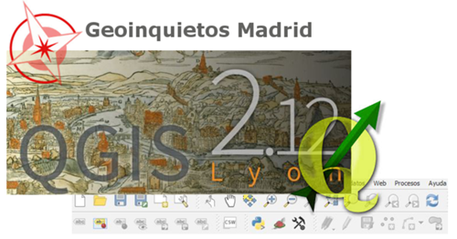

# Curso de Introducción a QGIS

## Resumen

* Título: Curso de Introducción a QGIS.
* Organiza: GeoInquietos Madrid y Medialab-Prado.
* Duración: 4 horas.
* Lugar: Medialab-Prado, Calle de la Alameda, 15, 28014 Madrid (Metro Atocha - Línea 1).
* Ponentes: Jesús García (organizador), Carmen Langa, Francisco Raga, Marco Rizzetto y Ramiro Aznar.

## Índice

* Presentación.
* Interfaz de Usuario.
* [Análisis vectorial](https://github.com/ramiroaznar/intro-qgis/blob/master/vectorial.md).
* [Complementos](https://github.com/ramiroaznar/intro-qgis/blob/master/complementos.md).
* Diseño de Mapas.

## Links

* [Medialab-Prado](http://medialab-prado.es/).
* [GeoInquietos](http://geoinquietos.org/) y [Meetup de GeoInquietos Madrid](http://www.meetup.com/es-ES/Geoinquietos-MAD/).
* [QGIS](http://www.qgis.org/es/site/).

## Datos

* Ríos de España.
* Espacios Naturales Protegidos de España.
* Comunidad de Madrid.
* Municipios de Madrid
* Límites Administrativos de España.