# Interfaz de Usuario

## Menús y barras de herramientas principales

### Menú de Proyecto
Este menú contiene las herramientas básicas gestión de proyectos y de archivos, crear un proyecto, guardar, etc.
Es muy importante el sub-menú **Propiedades del proyecto** que nos permite gestionar las propiedades básicas del proyecto como el título del proyecto, algunos colores de la interfaz y sobretodo el Sistema de *Referencia de Coordenadas* - **SRC** - del proyecto.
Del diseñador de impresiones se hablará en la última parte del curso.

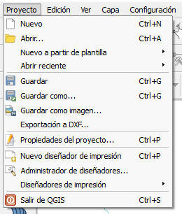
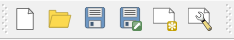

### Menú de Configuración
Este menú permite modificar las opciones y la configuración del programa, destaca el sub-menú *Opciones* que permite cambiar los ajustes de QGis tales como el idioma, el estilo de la interfaz, el SRC predeterminado, la reproyección al vuelo, etc.

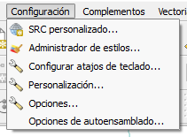
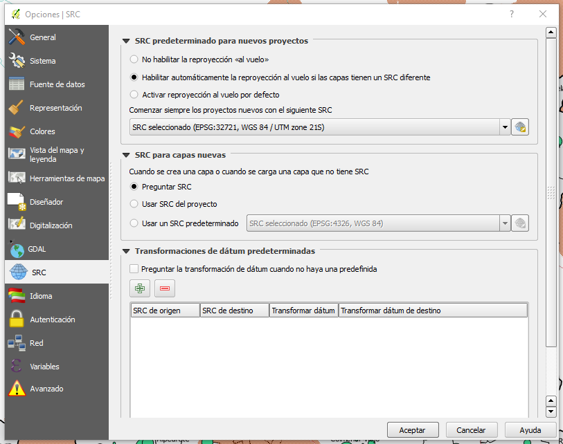

###Menú Ver
En este menú se encuentran las herramientas para desplazar el mapa, seleccionar objetos y elementos, hacer zum, medir, etc. Generalmente es más comodo acceder a estas herramientas desde la barra de herramientas *Navegación de Mapas* o directamente con los botones del ratón: botón central para desplazar, rueda para zumar, botón izquierdo para seleccionar y derecho para confirmar.
En el sub-menú *Paneles* y *Barras de Herramientas* se pueden encender o apagar las barras de herramienta de la interfaz gráfica y de los plug-in.

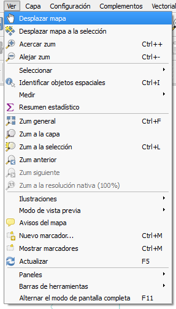
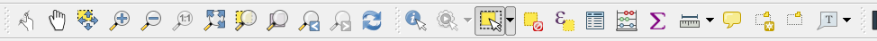

##Gestión de Capas

###Menú Capa
Este menú, seguramente uno de los más importantes, nos permite gestionar las capas en QGis, está estrictamente enlazado con el **Panel de Capas** y con la barra de herramientas **Administrar Capas**. Desde este menú podemos crear nuevas capas (Shape, Spatialite, etc.), añadir capas existentes al proyecto (vectoriales, raster, WMS...), guardar, conmutar edición, acceder al menú de propiedades de una capa, y abrir la tabla de atributos, entre otras cosas... 

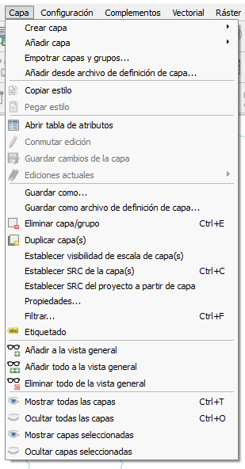

###Añadir Capas
Vamos a ver ahora como añadir algunas capas, todas las capas que vamos a utilizar durante este mini-curso están en la carpeta "*/datos*".

* Añadir una capa vectorial usando el menú **Capa -> Añadir Capa -> Añadir Capa Vectorial** seleccionar "*Archivo*" y el archivo **/datos/CCMM.shp** que es una capa de tipo polígono del territorio de la Comunidad de Madrid

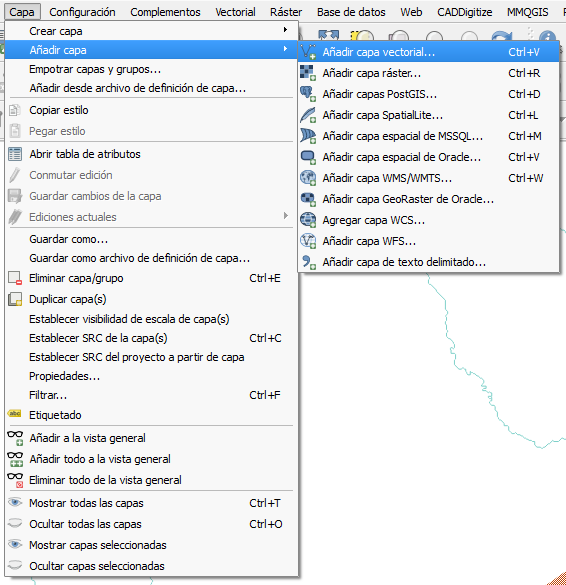

* Añadir una capa vectorial usando el botón correspondiende en la barra de herramienta Administrar Capas. Seleccionar el archivo **/datos/municipios.shp** con los límites de los múnicipios de la Comunidad de Madrid y añadirlo al proyecto, repetir con el archivo **/datos/enp_pb_2015.shp** que contiene las áreas protegidas de la península Iberica.

* Añadir una capa usando el **Panel del Explorador**. Navegar en el panel hasta la carpeta **/datos/** y arrastrar el archivo **rios.shp** en el **Panel de Capas**. Esta capa contiene los datos geografico de los ríos de España peninsular.

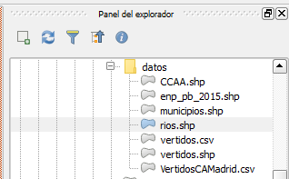

* Añadir una capa de datos CSV usando el botón "**Añadir capa de texto delimitado**" en la barra de herramientas de capa.

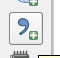

 Navegar hasta encontrar el archivo **/datos/VertidosCAMadrid.csv** y seleccionarlo, ponerle un nombre a la capa que vamos a añadir, seleccionar el formato de archivo correcto (en este caso CSV valores separados por coma) y seleccionar la definición de geometría correcta, en este caso *coordenadas del punto*. Para que QGis pueda importar correctamente las coordenadas es importante seleccionar la columna correcta de las dos coordenadas y, en este caso, no marcar que son coordenadas GMS. Una vez que hemos comprobado que en la preview los campos corresponden con los que necesitamos podemos añadir la capa.

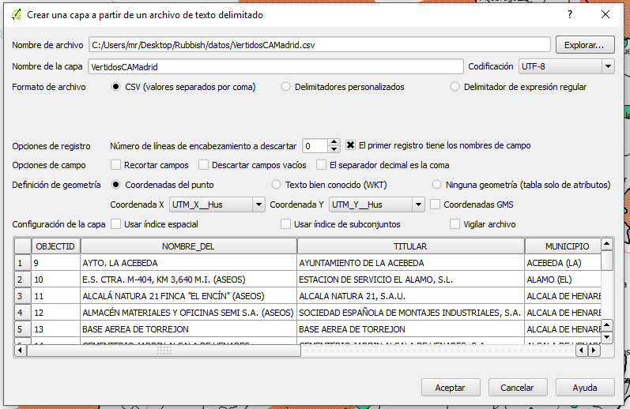

* Áñadir una capa WMS - *Web Map Service* usando el botón "**Añadir capa WMS/WMTS**" en la barra de herramientas de capa.

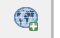

Utilizaremos uno de los servicios que ofrece la plataforma web de la Comunidad de Madrid (pero el ayuntamiento de Madrid y el Instituto Geográfico Nacional ofrecen servicios similares) añadiendo la ortofoto del territorio de la comunidad. En la página web de la [IDEM - Infraestructura de Datos Espaciales Comunidad de Madrid](http://www.madrid.org/cartografia/idem/html/web/ortofotografias.htm) podemos encontrar la URL del servido WMS de la ortofoto del año 2014 "http://www.madrid.org/cartografia/wms/wms_orto_2014.xml".

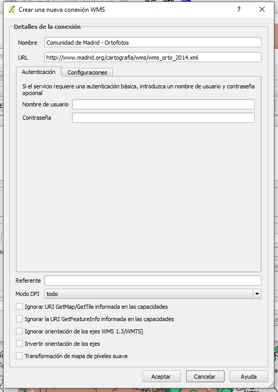

Una vez que tengamos la dirección del servidor podemos crear una nueva conexión WMS, conectarnos al servidor y finalmente crear una nueva capa.

###Panel de Capas
El panel de capas es la herramienta de QGis para gestionar la visibilidad y el orden de las capas, para seleccionarlas y para manipularlas en general. En este menú podemos encender o apagar capas o arrastrarlas para cambiar el orden de visualización, la capa más arriba en el panel corresponde con la capa más arriba en el espacio mapa y por tanto en general cubrirá los objetos inferiores. En este menú podemos definir *presets* de visualización, filtrar las capas, crear grupos y naturalmente eliminar capas o grupos.

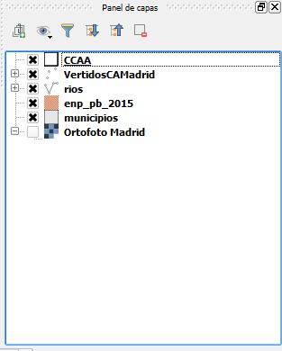

###Visualización de las capas
Cada capa en QGis puede tener su propio estilo, esto significa que podemos asignar a cada capa una simbología, un estilo de visualización, un color, una etiqueta, podemos definir la visibilidad dependiendo de la escala, etc.

* Símbolo único: es la forma más sencilla de visualizar un objeto, todos los objetos espaciales en esta capa tendrán el mismo estilo de visualización.
Podemos por ejemplo editar el estilo de la capa CCMM.shp, esta capa contiene sólo un objeto y nos interesa ver sólo sus limites, por tanto podemos seleccionar la visualización de la capa como *línea sencilla*.
A la capa de "áreas protegidas" podemos asignar un relleno de capa semi-transparente (denso4 por ejemplo) y quitarle el borde para que se vean las capas que están debajo.

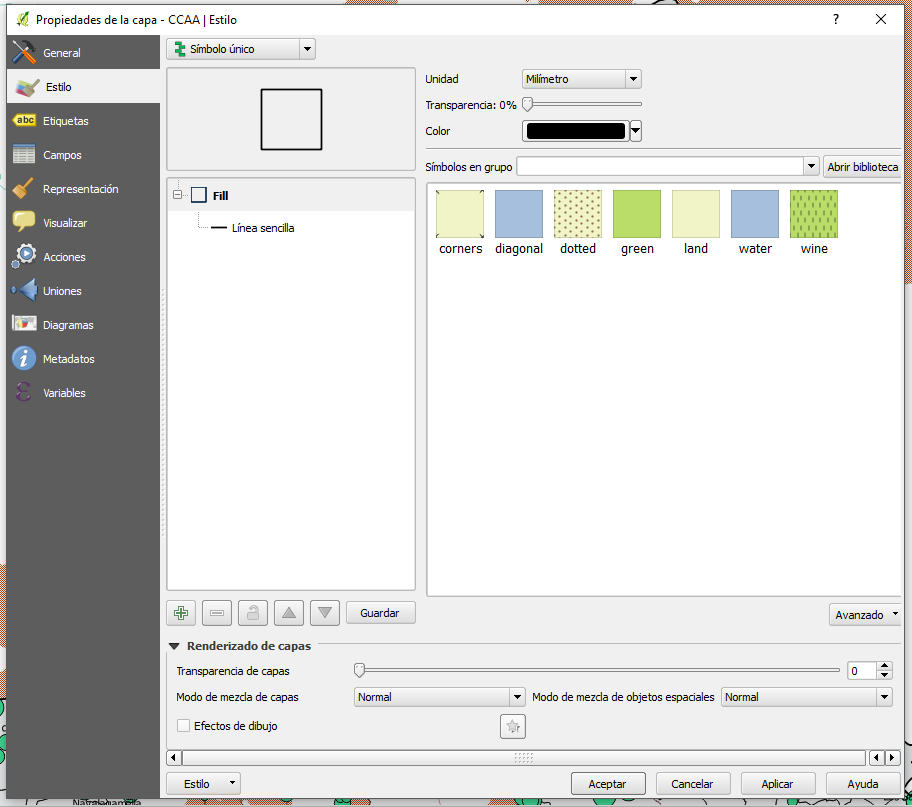

* Categorizado: usando este estilo los puntos estarán coloreados y clasificados según un campo con valores discretos. Podemos utilizar la categorización para visualizar las cuencas hídricas de los ríos de España usando el campo COD_DEMAR que corresponde al código de demarcación de los sistemas hídricos principales, QGis crea una categoría por cada valor presente en el campo seleccionado y nos permite cambiar la visualización de cada categoria.

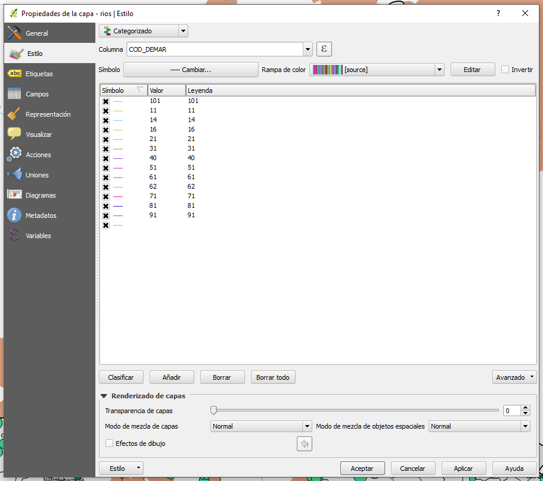

* Graduado: con el estilo de visualización graduado (se utiliza en general con variables continuas) se crean clases de valores, podemos determinar los intervalos manualmente o dejar que los calcule QGis dependiendo de funciones estadísticas, etc. el símbolo puede variar en función de la clase o puede variar sólo su tamaño o su color. En este caso que queremos visualizar los vertidos en función del volumen de agua que vierten y dividirlo en 4 clases que contengan el mismo número de puntos.

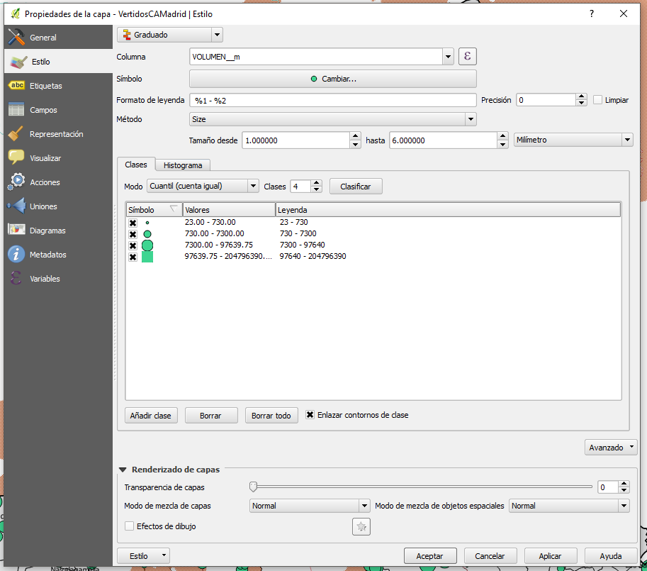

* Etiquetas: con las etiquetas podemos visualizar en el mapa principal algunos valores de los objetos espaciales. Por ejemplo podemos etiquetar los municipios con el campo "*nombre*" y tendremos en el mapa, en el centro de cada polígono la etiqueta con el nombre del municipio. En las opciones de la etiqueta podemos naturalmente variar el tamaño del texto, la fuente y sobretodo la ubícación o la rotación de la etiqueta en relación el objeto.

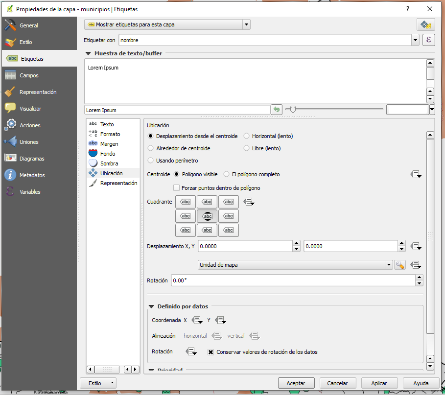

##La tabla de Atributos
Por último es importante hablar de la tabla de attributos, se puede acceder a la tabla desde el menú "**Capa -> Abrir tabla de atributos**" o con el botón en la barra de herramientas de Navegación o pinchando con el botón derecho en la capa en el Panel de Capas y seleccionando "Tabla de atributos". La interfaz de la Tabla de Atributos de QGis es muy potente e intuitiva, desde la interfaz directamente podemos conmutar la edición, borrar objetos, seleccionar objetos, visualizar en el mapa los objetos que seleccionamos en la tabla o vice versa buscar en la tabla los objetos que seleccionamos en el mapa, podemos crear nuevas columnas o borrar columnas, y sobretodo, podemos con la herramienta de "calculadora de campos" añadir nuevos campos calculando nuevos valores a partir de los datos que tenemos...

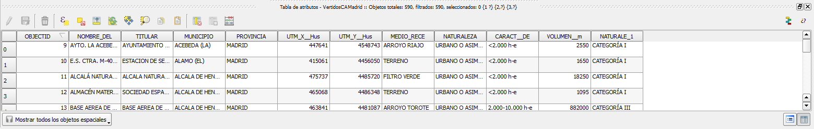
