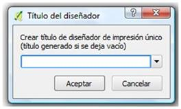
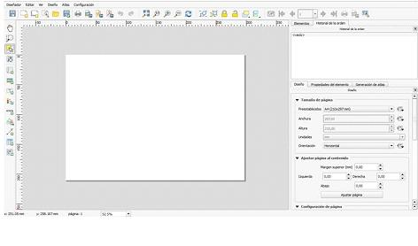
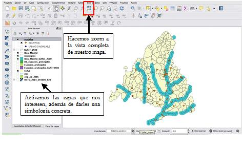
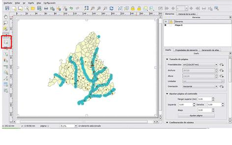
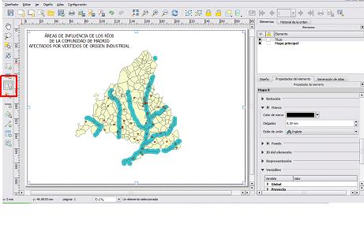
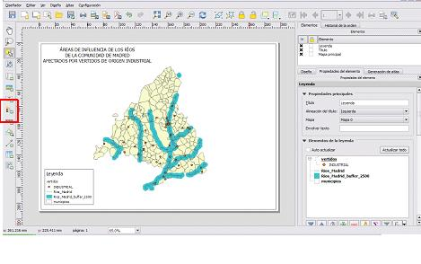
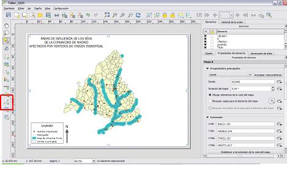
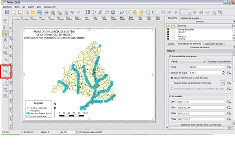
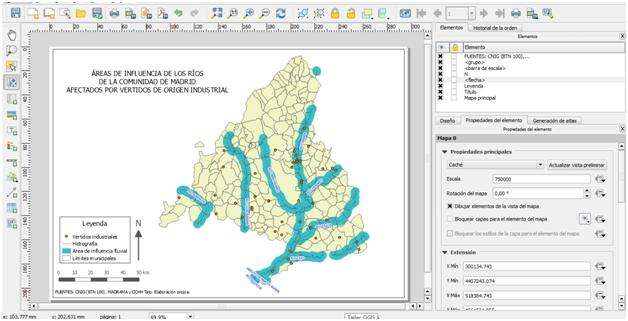

# Diseño de mapas

## El diseñador de impresión
 
El **diseño de mapas** es el proceso de situar los elementos del mapa en una hoja de papel de manera que con pocas palabras cualquier persona pueda comprender lo que se está representando.
El paso final de este curso introductorio de QGIS es el diseño del mapa que hemos estado elaborando. Para ello deberemos ir al menú `Proyecto` -> `Nuevo diseñador de impresión`. Se abrirá una ventana en la que podemos introducir el nombre del diseñador que vamos a crear o también podemos dejarlo en blanco:
 

El `diseñador de impresión` que se creará va a tener este aspecto:
 

Entre las opciones que tenemos a la derecha del diseñador de impresión, en la pestaña `Diseño` y el apartado `Tamaño de página`, podemos definir el tamaño de la hoja de impresión que vamos a utilizar (A4, A3, etc) o definir una nueva. También podemos definir la orientación de la hoja. En este caso dejaremos las opciones por defecto: `Presentación A4` y `orientación horizontal`.

A continuación insertaremos en nuestra nueva hoja los elementos principales de un mapa, que hacen que la comunicación con nuestros lectores sea efectiva. Estos elementos son:

* Cuerpo del mapa
* Título
* Leyenda
* Flecha del norte
* Escala
* Fuentes utilizadas para su elaboración o área de créditos.

Otros elementos que se pueden añadir son, por ejemplo, un mapa de localización, una cuadrícula, el nombre de la proyección cartográfica (SCR), otros textos adicionales, etc. Juntos, estos elementos ayudan al lector a completar la información mostrada en el mapa.

Vamos a realizar un ejemplo de una composición de mapa al mismo tiempo que se explica cada uno de estos elementos. El mapa que vamos a elaborar muestra las áreas de influencia de los ríos de la Comunidad de Madrid afectados por vertidos de origen industrial. Para ello necesitaremos activar las siguientes capas en QGIS:

* *Vertidos*: Tendremos que filtrar los de origen industrial.
* *Ríos de la Comunidad de Madrid*: Esta capa la hemos obtenido antes por intersección.
* *Buffer de ríos de la Comunidad de Madrid*: Esta capa la hemos generado con la herramienta buffer.
* *Municipios*: Esta capa la utilizaremos como fondo para nuestro mapa.

Estas cuatro capas son las principales capas que vamos a necesitar para realizar nuestro mapa. Se pueden añadir más capas siempre y cuando no confundan a los usuarios respecto de la finalidad del mapa.
Para que se muestren correctamente en nuestro diseñador de mapas será necesario darles una simbología acorde a nuestros objetivos además de hacer zoom a la superficie que queremos representar.
 

A)	El **cuerpo del mapa** es la parte más importante puesto que contiene la información del mapa. En este momento vamos a empezar a trabajar en el diseñador de mapas. Para añadir nuestro mapa tendremos que ir al menú `Diseño` -> `Añadir mapa` y dibujar el rectángulo que ocupará nuestro mapa, o bien:
 

B)	El **título del mapa** define lo que se está representando. Se puede comparar con el titular de un periódico. Tiene ser conciso al mismo tiempo que ofrece al lector la idea principal del contenido del mapa. Para insertar el título del mapa es necesario ir al menú `Diseño` -> `Añadir etiqueta`, o bien:
 

Esta opción nos permitirá también añadir cualquier tipo de texto a nuestro mapa.

C)	Por definición, un mapa es una representación simplificada del mundo real. En esta simplificación se utilizan símbolos para representar objetos reales. La **leyenda** sirve para explicar la simbología que aparece en el mapa. Generalmente se ubica en un pequeño recuadro en una esquina del mapa.
Para insertar la leyenda de nuestro mapa iremos al menú `Diseño` -> `Añadir leyenda`, o bien:
 

En las opciones de la derecha del editor de mapas podremos editar las propiedades de la leyenda, como por ejemplo, añadir o quitar elementos, cambiar el nombre, el tipo de fuente, etc.

D)	La **flecha del norte** (denominada también rosa de los vientos) es una figura que muestra las direcciones principales, Norte, Sur, Este y Oeste. En los mapas se utilizan para indicar la dirección del Norte y así poder orientarnos.
Para añadir la rosa de los vientos a nuestro mapa tendremos que ir al menú `Diseño` -> `Añadir flecha`, o bien:
 

E)	La escala de un mapa es el valor de distancia en el mundo real de una unidad de distancia en dicho mapa. La escala gráfica es la representación dibujada en un plano o mapa de la escala unidad por unidad, donde cada segmento muestra la relación entre la longitud de la representación y el de la realidad.
Para añadir la escala a nuestro mapa tenemos que ir al menú `Diseño` -> `Añadir barra de escala`.
 

F)	En el **área de créditos** de un mapa es posible añadir texto con información importante como por ejemplo, la información sobre las **fuentes de datos** utilizados, la **calidad de los datos**, **quién** y **cuándo** creó el mapa.
Para añadir esta información en nuestro mapa haremos el mismo proceso que cuando insertamos el título (añadir etiqueta nueva).
 

Podremos guardar nuestro mapa como imagen, pdf o svg. Para ello tenemos que ir al menú `Diseñador` -> seleccionar la opción que deseemos.
