# Análisis Vectorial

En este curso de *Introducción a QGIS* únicamente se explicará las herramientas de análisis
de uno de los tipos de datos geoespaciales: **los archivos o datos vectoriales**. QGIS tiene en 
su barra de herramientas una pestaña dedicada a este grupo de procedimientos: "Vectorial". Dentro 
de ella encontraremos las siguientes opciones:

* OpenStreetMap
* Herramientas de Análisis
* Herramientas de Investigación
* Herramientas de Geoproceso
* Herramientas de Geometría
* Herramientas de Gestión de Datos

Debido al enfoque introductorio de este curso, de estas seis aplicaciones solo se tratarán 
cuatro de ellas: `geoproceso`, `investigación`, `geometría` y `análisis`. Estos mecanismos permiten al usuario interactuar con una o dos capas vectoriales, pero **siempre que estén en la misma proyección**.

# Herramientas de Geoproceso

El geoprocesamiento es una de las operaciones más útiles que presenta un software GIS. QGIS 
presenta una selección de las más potentes, además otras tantas pueden ser añadidas a través
de *plugins*. Entre ellas hemos destacado las operaciones de `intersección`, `buffer`, `diferencia`
y `corte`.

### Intersección

A partir del mecanismo de intersección, el usuario puede cruzar dos capas y obtener una nueva con la combinación deseada de *atributos* y configuración espacial. En nuestro caso queremos obtener de la capa de espacios protegidos  únicamente aquellos que `interseccionen` con la capa de la Comunidad de Madrid.

De igual manera sucede en el caso de los ríos.

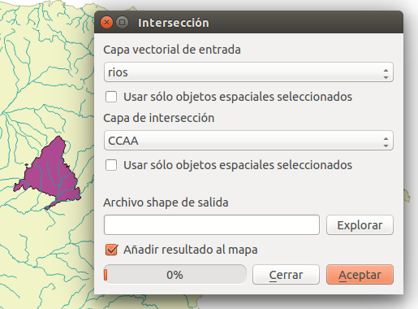

Como resultado obtendremos dos capas nuevas, una de espacios protegidos y otra de ríos, ambas limitadas a la Comunidad de Madrid.

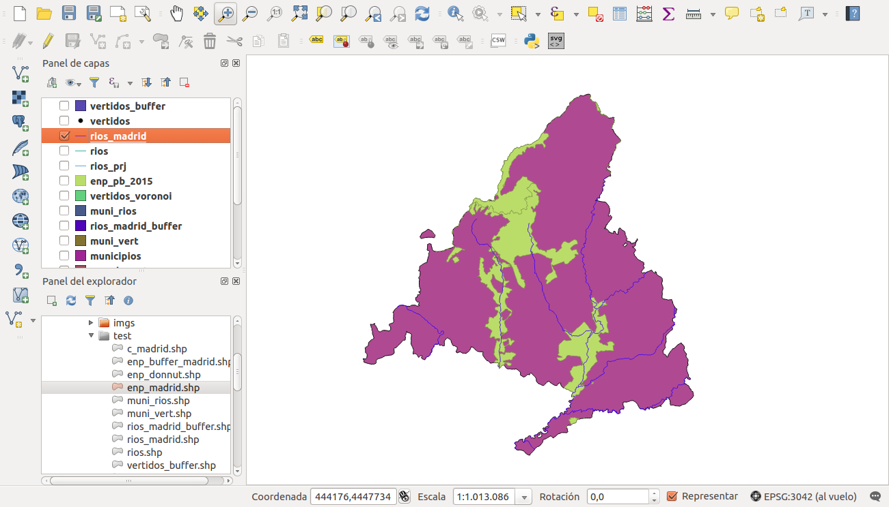

### Buffer

Los "buffer" pueden ser considerados como las operaciones más propias y más usadas en tecnologías
GIS. Tienen multitud de aplicaciones, desde la protección de la naturaleza hasta la gestión de ruidos
en carreteras. El mecanismo es en principio sencillo (aunque puede crecer en complejidad), se
genera una capa nueva alrededor de otra capa que puede ser de puntos, líneas,
o polígonos. Esta nueva capa (poligonal) tendrá la superficie de la primera más el "área de influencia" con una `distancia` que el usuario ha decidido previamente. La unidad de medida que presenta este valor está determinada por las propiedades generales del *proyecto* (en nuestro caso *metros*).

Utilizaremos la capa de vertidos para usarla como ejemplo de buffer de puntos. Seleccionamos esta capa como `capa de entrada`, introducimos la `distancia` y damos nombre a la nueva capa de salida.

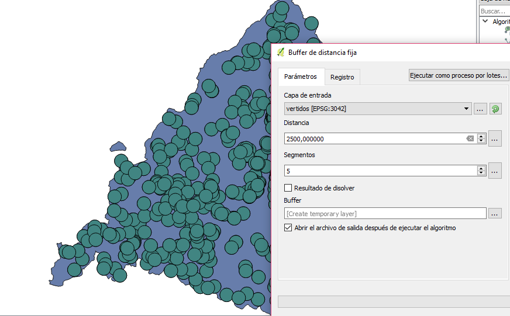

Probar de nuevo el buffer de puntos con la opción "Resultado de disolver".

En segundo lugar usaremos la capa de ríos de la Comunidad de Madrid que habíamos generado previamente como ejemplo de buffer de líneas. Seleccionamos esta capa como `capa de entrada`, introducimos la `distancia` y damos nombre a la nueva capa de salida.

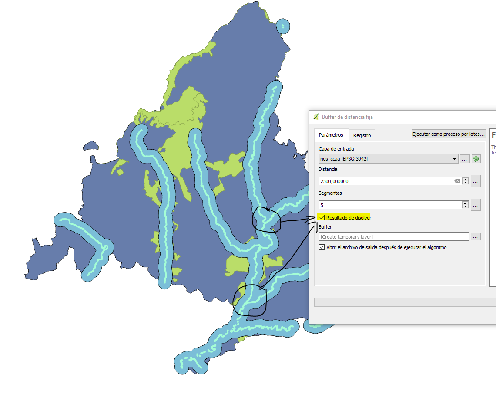

Por último, la capa de espacios protegidos de la Comunidad de Madrid que también habíamos generado previamente se usará como ejemplo de buffer de polígonos. Seleccionamos esta capa como `capa vectorial de entrada`, introducimos la `distancia` y damos nombre a la nueva capa de salida.

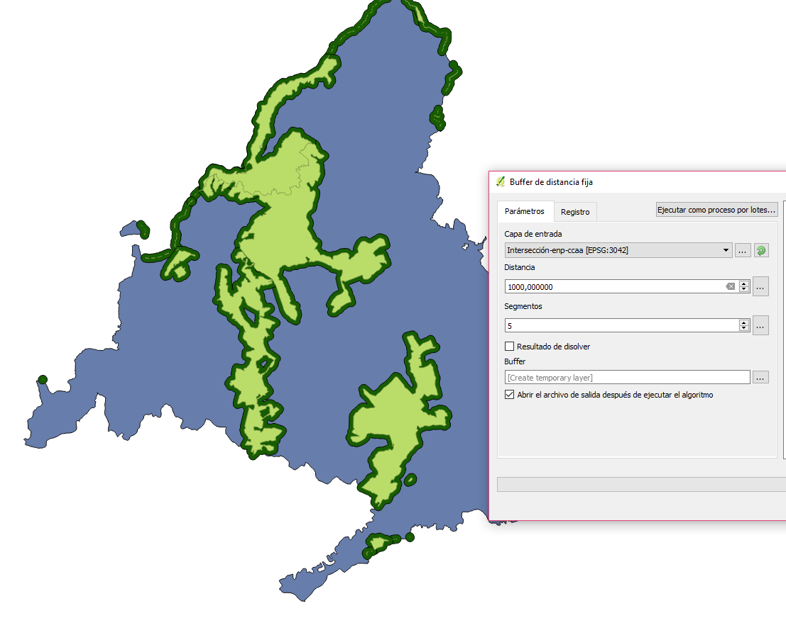

### Corte

La operación de corte o "clip" también podría considerarse como una de las más comunes dentro de las herramientas GIS. Al contrario que la anterior operación, una capa es cortada por otra considerada como "molde" o "máscara" dando lugar a una nueva con las características de la primera pero la geometría de la segunda.

En nuestro ejemplo usaremos la capa de los límites administrativos de España (`capa vectorial de entrada`) y la cortaremos con la capa de la Comunidad de Madrid (`capa de corte`). Y después de darl enombre a la capa de salida obtendremos una nueva capa vectorial con la superfice de Madrid pero con los atributos de la capa de España.

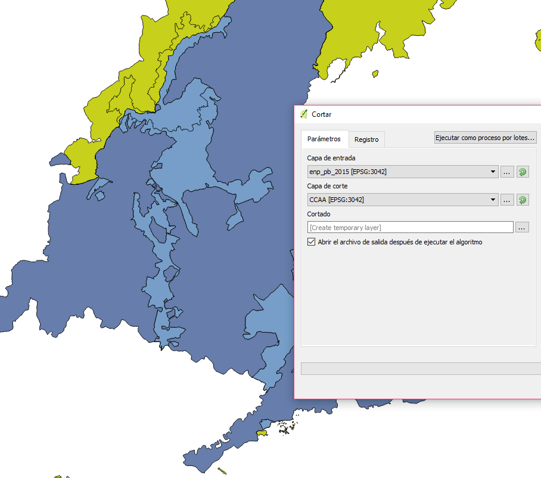

**Bonus** Post recomendado: [*Las 10 herramientas de Geoprocesamiento fundamentales en GIS*](http://mappinggis.com/2014/10/herramientas-de-geoprocesamiento-en-gis/).

# Herramientas de Investigación

Dentro de las herramientas de investigación nos encontramos con la herramienta de "Seleccionar por localización..." Esta herramienta fundamental nos permite la selección de elementos de una capa a partir de la geometría de una segunda capa.

### Selección por Localización

Esta herramienta de selección nos permite seleccionar elementos de una capa a partir de los elementos de otra. Para ver cómo funciona, realizaremos el siguiente ejemplo:

- Seleccionar qué vertidos están a menos de 2500 m de los ríos. Para este ejercicio, utilizaremos la capa generada anteriormente con el buffer de los ríos de 2500 m (rios_buffer2500).

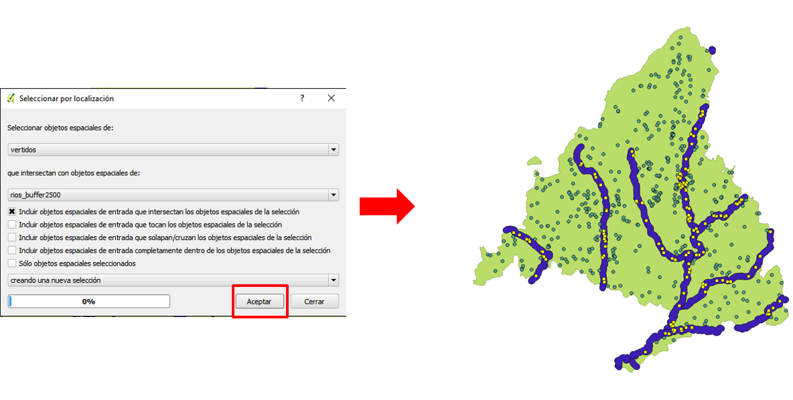

El resultado obtenido será la selección de los vertidos (153) que intersectan con la capa de rios_buffer2500.

- Visualmente, los registros seleccionados son aquellos que están de color amarillo.

- En la tabla de la capa, serán aquellos que están de color Azul. (ven siguiente imagen) 

# Herramientas de Análisis

Esta caja de herramientas nos permite realizar operaciones básicas de análisis como 
contar puntos o calcular la longitud de líneas en una capa base de polígonos.

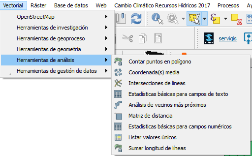

### Contar Puntos en Polígonos

Esta opción nos permite calcular la suma (u otra operación aritmética) de puntos que
se encuentran sobre una capa poligonal. 
Una vez en la ventana debemos seleccionar la capa **poligonal**, la capa de **puntos**, el **nombre del campo de cuenta**.  
EN la opción **numero** asignaremos el nombre de la capa. (podemos dejarla como capa temporal)

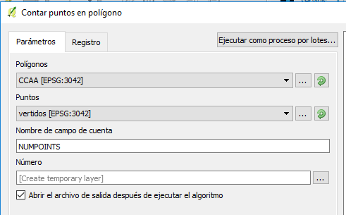

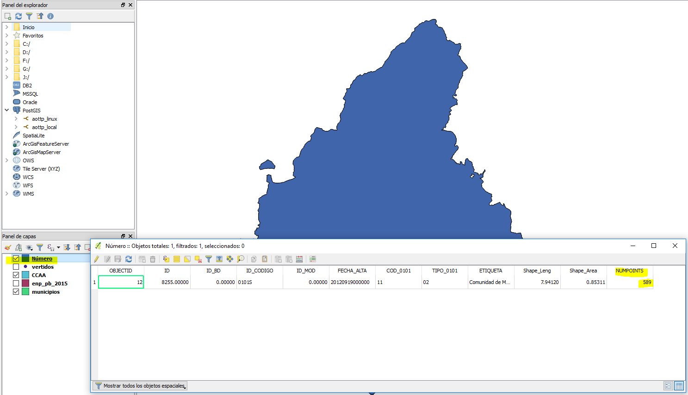

Como resultado obtenemos una nueva capa igual que la capa vectorial de polígonos de entrada con los nuevos campos calculados. En nuestro ejemplo habrá añadido los siguientes campos:

- *NUMPOINTS*: Nº de vertidos dentro de la capa de CCAA

Como ejercicio adicional, se propone calcular qué municipio tiene mayor nº de vertidos.
 
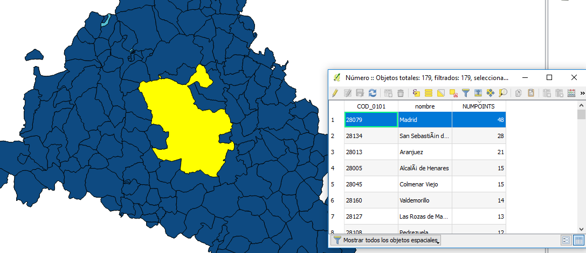

Como resultado dará que Madrid es el municipio que mayor nº de vertidos tiene 48 vertidos.

### Sumar Longitud de Líneas

Esta herramienta nos permite calcular la longitud de una capa de líneas que se encuentran sobre una capa poligonal. Una vez en la ventana debemos seleccionar la capa poligonal, la capa de líneas y el nombre del nuevo campo donde aparecerá la longitud y el campo donde se almacena el nº de segmentos. Por último nombraremos el archivo de salida.

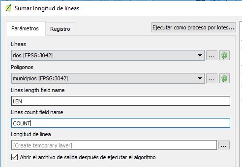

# Herramientas de Geometría

Estas herramientas sirven para el análisis de la geometría y la obtención de nuevas capas a partir de la capa inicial.

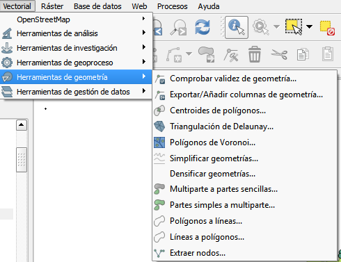

Como ejemplo, vamos a simplificar la geometría de la capa de rios de la ccaa de madrid, generando una nueva capa de líneas con menos nodos.

### Simplificar geometrías

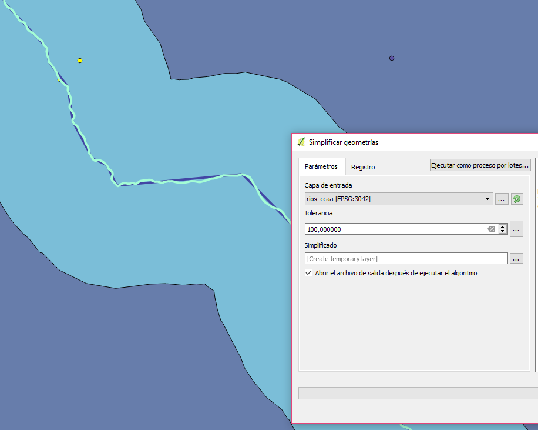

Como resultado obtenemos una nueva capa de tipo lineal donde los nodos que definen está capa están a 100 m de distnacia unos de otros.